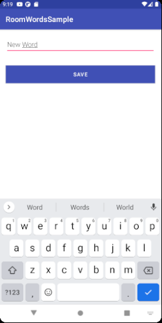
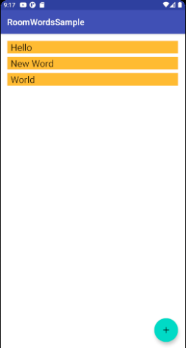

# Week 5 Assignment

## Task Instructions
* Create an new Github Repository on your personal Github Account say like 'My First App'
* Create a New project on Android Studio call it 'My First App'
* Open terminal on your Android Studio run the command git init
* Follow the instructions on your new repo on Github to link your local app to your Github repo. Use the second option of or push an existing repository from the command line
* After you have finished to link your local app to github code a simple app based on the tutorial at Android Room with a View - Java  or Android Room with a View - Kotlin
* On your root folder add a folder 'screenshots' and put screenshots of your app taken from your emulator or phone when you were running your app
* Describe your project in the readme appropriately linking the screenshots of your project to it. Use my sample https://github.com/JacksiroKe/RoomSampleApp to get a better understanding of what I need you to be doing
* Commit on your changes to your Github account
* Report what you have done including the appropriate links to your work here on the platform, without which you will be assumed to not have participated.

## App Overview

This app is has a simple UI that makes use of Android's Room Database API for Object Relational Mapping (ORM) to an SQLIte database that saves words. To save a new word, the add action button is pressed, which opens a text box in which the word can be typed and saved:

The new word gets saved into the SQLite database with the help of the Room Database ORM. Associating a row in the word table to a viewable word entity on a recycler view.

